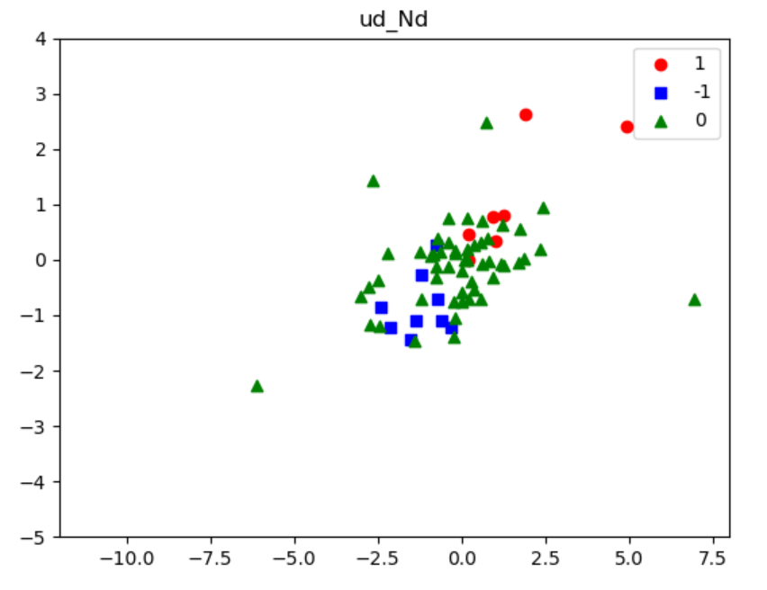
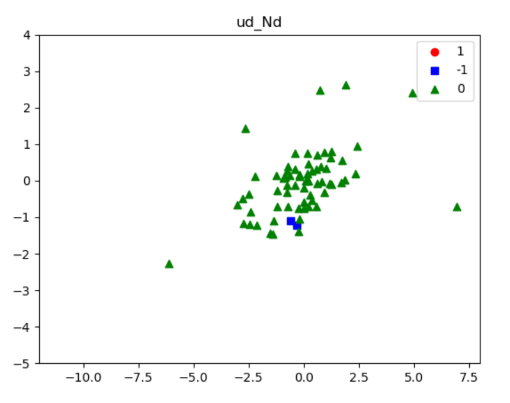

# 목표: 주가 데이터를 적절히 가공해 K-NN을 접목시킨 적절한 데이터 모델을 만든다.
----------------
###### Stockdata_Analysis (KPU_Bigdata Lecture TeamProject)

  1. 기본 제공 데이터 stock_history.csv

    [2017.01.16 ~ 2017.12.22]동안의 날짜별 주가 데이터(STOCK_HISTORY)를 저장하고 있다. 
  > < STOCK_HISTORY의 컬럼명 >
  > - basic_date: 거래날짜
  > - stockname: 종목명
  > - stock_code: 종목코드
  > - open_value: 시가
  > - high_value: 고가
  > - low_value: 저가
  > - close_value: 종가
  > - volume_value: 거래량(거래주식수)
  > 
  2. sorting_data.py 파일을 통해 데이터 준비
  
  (한가지 종목을 선정하여 가공하도록 구현, 가공 후 'stock_history_added.csv'파일로 저장
  본 프로젝트에서는 '고려아연' 종목을 선택함)
  
  > - cv_diff_value: 종가 일간 변화량
  > - cv_diff_rate: 종가 일간 변화율
  > - cv_maN_value: 종가의 N일 이동평균, (예: N=5)단, 5일이 안되는 기간은 제외
  > - cv_maN_rate: 종가의 N일 이동평균의 일간 변화율, (예:N=5) cv_ma5_rate, 단, 5일이 안되는 기간은 제외
  > 
  > - ud_Nd:
  >
  >     (a) N일 연속 종가가 상승할 때, (N-1)번째 날의 값은 1, 
  > 
  >     (b) N일 연속 종가가 하락할 때, (N-1)번째 날의 값은 -1, 
  > 
  >     (c) 그렇지 않은 날의 (N-1)번째 날 값은 0
  > 
  > - cvNd_diff_rate: N일간의 종가 상승률을 (N-1)번째 날의 값으로 설정
  > 
  
  3. apply_knn.py 파일
  > - 준비된 데이터를 7:3비율로 나누어 학습데이터와 테스트 데이터로 분리
  > - 종속변수는 udNd로 설정
  > - 독립변수를 설정 함 (본 프로젝트에서는 가장 정확도가 높은 'cv_diff_value'와 'cv_maN_rate'를 선택)
  > 

  4. main.py
  
  ( 데이터 준비, KNN적용 실행, 결과화면 도출 까지 실행되도록 구현되어 있음 )
   
--------------------
### 실행 결과 - 산점도 확인 plot

